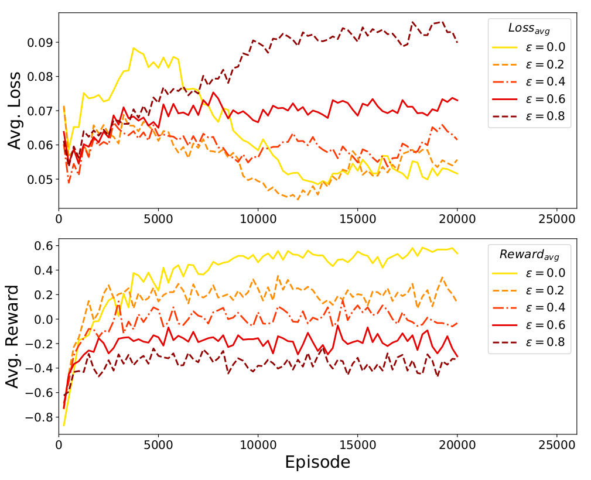
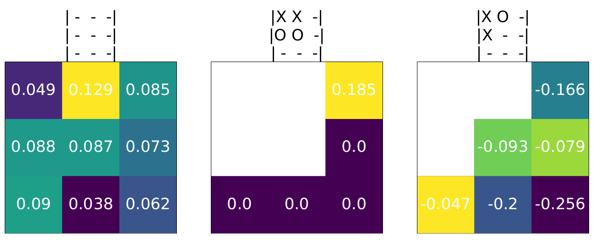
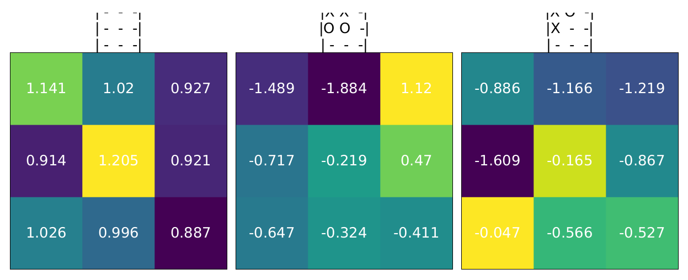

# CS-456_RL_Project

## Features

1. Q-Learning and Deep Q-Learning implementation with Experience Replay
2. Decrease exploration strategy
3. Self-practice strategy
4. Documentation with types hinting
5. Visualization of rewards, losses, metrics, and learned Q-values

    - Reward and loss visualization

        

    - Q-Table

        | Q-learning | DQN |
        | --- | --- |
        |  |  |

## Introduction

In this mini-project, our goal is to use Q-Learning and Deep Q-Learning to train artificial agents that can play the famous game of [Tic Tac Toe](https://en.wikipedia.org/wiki/Tic-tac-toe).

## File structure

```shell
❯ tree -L 1
.
├── main.ipynb # Main notebook
├── plot/ # generated folder to save plots
├── res/ # generated folder to save resulted loss, reward, and metrics files
├── readme.md # Readme file
├── q_player.py # Q-Learning player
├── dqn_player.py # Deep Q-Learning player
├── dqn_utils.py  # Deep Q-Learning utilities
├── tic_env.py # Tic-Tac-Toe environment
└── viz_utils.py
```

## Environment

```python
conda create -n ann python=3.7
conda activate ann
conda install -y numpy
conda install -y matplotlib

# notebook and extension
python -m pip install notebook
conda install -c conda-forge ipywidgets -y
python -m pip install jupyter_contrib_nbextensions
pip install nbconvert==6.4.3
# jupyter contrib nbextension install --user

# CUDA 11.3 with torch
conda install -y pytorch==1.10.1 torchvision==0.11.2 torchaudio==0.10.1 cudatoolkit=11.3 -c pytorch -c conda-forge

# misc
python -m pip install tqdm
```

## Future work

- Test different reward functions
- Test different DQN variants
